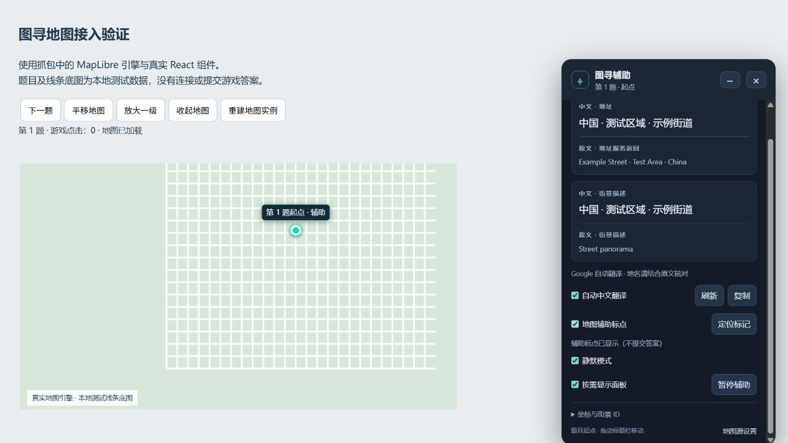

# 图寻辅助

适用于 [图寻](https://tuxun.fun/) 的 Tampermonkey 用户脚本。当前版本 **1.6.0**，提供当前题目起点信息、中外文对照和地图辅助标点。

## 功能

- 根据当前题目的 pano ID 匹配街景数据，忽略其他 pano 响应。
- 支持已验证的挑战模式 `challenge/getGameInfo` 和排位等模式的 `solo/get` 接口。
- 由网站题目响应触发更新；遇到其他街景请求时，合并触发一次题目确认，连续触发至少间隔 1.5 秒。同一题的重复响应不重复查地址。
- 页面可见且已有题目查询地址时，保留每 30 秒一次的兜底同步；隐藏页面或离开游戏页面后停止。
- 可拖动、折叠的悬浮面板，支持复制信息与配置地图源。
- 默认按需显示：启动时只显示“图寻”小按钮，点击或按 Alt+Shift+T 打开面板。隐藏面板会移除面板 DOM 和相关监听，题目信息继续更新。
- 默认开启静默模式：不弹配置窗口，不向控制台输出本脚本日志。错误状态仍在面板显示。
- 标签页隐藏时暂停额外查询、取消进行中的查询并清理辅助标记，返回页面后同步恢复。离开游戏页面后停止题目轮询。
- 地址及街景描述的中文与原文对照，翻译失败时保留原文。
- 在网站右下角的华为底图上绘制辅助标记，支持定位、地图缩放和拖动、地图重建后重连。
- 一键暂停辅助，取消请求并清理标记、后台定时器和功能监听；恢复入口保留。暂停状态在刷新后仍生效。
- 网络响应观察、存储、面板和地图错误独立处理；保留网站原请求的返回值与异常，不消费原响应正文。

辅助标记显示题目的**起点**，不会自动设置正式答题落点或提交答案。

## 安装

1. 在浏览器中安装 Tampermonkey。
2. 打开 [Greasy Fork 发布页](https://greasyfork.org/zh-CN/scripts/598289)，点击 **安装此脚本**，在 Tampermonkey 中确认安装。
3. 禁用旧版及其他同名辅助脚本，确保只启用一个版本。
4. 刷新图寻页面，点击右侧 **图寻** 小按钮或按 **Alt+Shift+T** 打开面板。静默模式保留已有地图源设置；没有设置时默认使用 OSM。点击“地图源设置”可选择高德并输入自己的 Web 服务 Key。

从 Greasy Fork 安装的版本由该平台提供安装与更新地址。此前从 GitHub 或本地文件安装的用户，可从上述发布页重新安装；确认只启用一个版本。GitHub 推送与 Greasy Fork 发布目前分别进行。

## 使用

- **刷新 / I**：重新查询当前题目的地址。
- **地图源设置 / R**：重新选择地址查询服务。
- **自动中文翻译**：开启或关闭 Google 翻译。关闭时取消翻译请求与超时任务；重新开启只翻译现有文本，不重复查询地址。
- **静默模式**：默认开启。启用时折叠面板，关闭后恢复本脚本的控制台日志；不影响题目更新方式。
- **按需显示面板**：默认开启；下次启动只显示小按钮。面板右上角 **×** 或 **Alt+Shift+T** 可隐藏面板，点击小按钮重新打开。关闭此设置后启动时显示完整面板容器（静默模式仍默认折叠）。
- **暂停辅助**：停止额外请求，移除标点、面板、请求观察、定时器和功能监听；仅保留恢复按钮与快捷键。点击“恢复辅助”或按 **Alt+Shift+T** 恢复。
- **地图辅助标点**：显示或移除辅助标记。关闭时同时移除地图事件监听、DOM 观察器及连接重试任务。
- **定位标记**：移动地图视野到当前题起点；地图未展开时会等待地图可用。

拖动面板标题栏可以移动面板，右上角按钮可折叠。位置、折叠状态和功能开关保存在当前网站的本地存储中。

隐藏面板仅改变显示方式；需要停止后台工作时使用“暂停辅助”。静默模式不提供反检测保证。

## 预览

下图使用网站抓包中同版本的 MapLibre 引擎、真实 React 组件及本地测试数据，**不是实际游戏截图**。



## 适配范围与限制

- 已通过挑战、排位模式数据回放和异步状态回归测试。其他模式或后续网站接口变更未保证适配；无法确认当前题目时不会按任意 pano 猜测位置。
- 换题没有产生可观察的题目或街景请求时，要等下一次 30 秒兜底同步，也可以点击“刷新”。脚本不会凭其他街景 ID 直接判断答案。
- 暂停期间错过街景数据时，恢复后先确认当前题，再按需补取已验证的 QQ 街景元数据；其他来源需要等待网站重新加载相应街景，必要时刷新页面。
- 地图接入依赖页面的 React 引用结构。已在同版本地图引擎与 React 测试页验证，实际游戏页面仍需自行确认。
- 显示“尚未连接地图”时，先展开右下角地图；如果仍无法连接，原有地址面板可继续使用。
- 翻译使用 Google 网页翻译接口，属于尽力提供的功能；网络、跨域策略和服务限制可能导致失败。地名应结合原文核对。
- 坐标直接采用网站街景元数据；不同底图、坐标系及逆地理编码可能存在偏差。

## 数据与外部请求

- 脚本读取页面的题目及街景请求，并调用已捕获的题目查询地址同步题目。恢复辅助或手动刷新时，必要时按已确认的 pano ID 补取 QQ 街景元数据。
- 根据所选服务，将坐标发送到 OSM Nominatim 或高德逆地理编码服务；街景 ID 可发送到腾讯或百度以获取描述。
- 开启翻译时，将地址与街景描述发送到 Google 翻译，不发送账号资料或整个题目响应。
- 高德 Key 和设置存储在图寻域名下的 `localStorage`。仓库不包含 Key、账号凭据、HAR 或用户抓包数据。
- 项目没有自建后端、统计上报或答案提交功能。

## 本地检查

需要 Node.js 18 或以上版本，无需安装 npm 依赖：

```sh
npm test
```

15 项合成数据回归场景覆盖题目匹配、重复响应去重、事件合并、同页换题、后台暂停、资源清理、恢复补取、翻译取消和故障隔离。另在本地真实 React / 同版本地图引擎页面验证面板显示、暂停恢复及地图重连；不代表对实时网站的端到端保证。

## 来源与许可证

基于 Yu 的 [tuxunScript](https://github.com/YU-1021/tuxunScript) 用户脚本 v1.1 修改。原作者与许可证声明保留在脚本头部。

本版本新增或修改了当前题目匹配、异步隔离、接口适配、悬浮面板、翻译对照和地图辅助标点。

按 [GNU AGPL v3](LICENSE) 发布。
